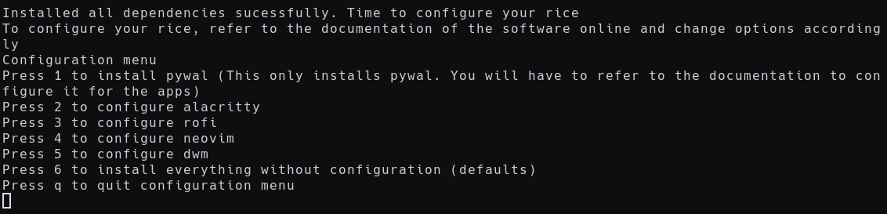

# Joshua's Artix Dotfiles [dwm + custom status + alacritty + rofi]

## Info

Dotfiles for my artix rice. Includes-
1. [x] Xorg server, video driver and basic fonts
2. [x] DWM (minimal window manager)
    - [x] custom-made status bar
    - [x] patches
        - Alpha (Transparency)
        - Always center (To center windows)
        - Fullscreen
        - Hide tags
        - Pywal Patch
        - Self Restart
        - Tag Labels
        - Underline tags
        - Xresources + xrdb
        - Status 2d with xrdb support
        - Winicon
        - Gapps
3. [x] Rofi (application launcher)
4. [x] Alacritty (terminal)
5. [x] Neovim (text editor)
6. [x] Neofetch (for system info)
7. [x] CMatrix (cool matrix tool)
8. [x] Maim and Xclip (screenshot tools)
9. [x] Pywal (color scheme generator)
10. [x] And additional tools as needed

## My rice works on the following distros as of now
1. Debian
2. Fedora
3. Void
4. Arch **[TRIED AND TESTED!]**


5. Gentoo

Feel free to fork my project to match your distro if you don't use one of the currently supported distros.

## Installation
1. Make sure you have git installed. Clone the repository using git clone:
    ```git clone https://github.com/joshee2004/artix-dotfiles```
2. cd to artix-dotfiles and run install.sh:
    ```cd artix-dotfiles && ./install.sh```
3. The installer will automatically detect your package manager and install the required softwares. Enter your password and press y to confirm installing the required packages.
    
4. After that, you'll be asked to configure each software. You will have to refer to the documentation of the required softwares to configure. If you want to install everything with the default configuration, Press 6.
    
5. Selecting option 1 will install pywal and configure it for alacritty. Configuration of softwares other than dwm are pretty straight forward and involve editing the configuration file to suit your needs.
6. For dwm, you'll be given an option to configure dwm, install it or quit the installation.
    - Press c to return back to configuration menu
    - Press i to save changes and install dwm    
    - Press q to quit the installer

    
6. Reboot after installing dwm to use it.
7. After rebooting, to enable pywal, go to the repo directory and run pywal.sh:
    ```cd artix-dotfiles && ./pywal.sh```

## Configuration
### DWM
Configuring dwm is pretty simple. You have 3 files:
- theme.h (colors, fonts, transparency)
- layout.h (the way bar is shown)
- keys.h (keybindings)
Edit these files to suit your taste and run `sudo make clean install` or `doas make clean install` to reflect the changes.
If you want to add patches, you will have to manually patch them. Auto patchers are prone to issues and it is double work to fix them. Instead, it saves time and effort to manually patch them.
### Alacritty, rofi, neovim, neofetch
Refer to the documentation of the concerened softwares for help.
### Pywal
For pywal, visit https://github.com/dylanaraps/pywal/wiki/Customization for more information

## Bugs
If there are any bugs feel free to report them to me!
