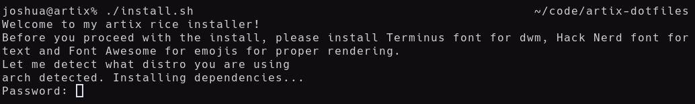
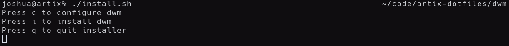

# Joshua's Artix Dotfiles

## Info

Dotfiles for my artix rice. Includes-
1. [x] Xorg server, video driver and basic fonts
2. [ ] Light DM (login shell)
3. [x] DWM (minimal window manager)
    - [x] custom-made status bar
    - [x] patches
        - Alpha
        - Self Restart
        - Fullscreen
        - Hide tags
        - Tag Labels
        - Underline tags
        - Xresources + xrdb
        - Status 2d with xrdb support
        - Winicon
        - Gapps
        - Centered Windows
4. [x] Rofi (application launcher)
5. [x] Alacritty (terminal)
6. [x] Neovim (text editor)
7. [x] Neofetch (for system info)
8. [x] CMatrix (cool matrix tool)
9. [x] Maim and Xclip (screenshot tools)
10. [x] Pywal (color scheme generator)
11. [x] And additional tools as needed

## My rice works on the following distros as of now
1. Debian
2. Fedora
3. Void
4. Arch **[TRIED AND TESTED!]**


5. Gentoo

Feel free to fork my project to match your distro if you don't use one of the currently supported distros.

## Installation
1. Make sure you have git installed. Clone the repository using git clone:
    ```git clone https://github.com/joshee2004/artix-dotfiles```
2. [ ] TODO ~~cd to artix-dotfiles and run install.sh:~~
    ~~```cd artix-dotfiles && ./install.sh```~~
2. As my project is still being developed, there is no direct install as of now. But I do have a working install script for dwm. cd to dwm and run install.sh:
    ```cd artix-dotfiles/dwm && ./install.sh```
3. The installer will automatically detect your package manager and install the required softwares. Enter your password and press y to confirm installing the required packages.
    
4. After that, you'll be asked to configure dwm. You can edit the theme, layouts and keybinds to match your needs.
    
5. Now you'll be given an option to continue configuring dwm, install it or quit the installation.
    - Press c to return back to configuration menu
    - Press i to save changes and install dwm
    - Press q to quit the installer
    
    
6. Reboot after installing dwm to use it.
7. After rebooting, to enable pywal, go to the repo directory and run pywal.sh:
    ```cd artix-dotfiles && ./pywal.sh```

NOTE: My dotfiles does not include alacritty as of now, and will be added in a future update. So to use the terminal after installing dwm, make sure you install alacritty using your favorite package manager.

## Configuration
For pywal, visit https://github.com/dylanaraps/pywal/wiki/Customization for more information

## Bugs
If there are any bugs feel free to report them to me!
